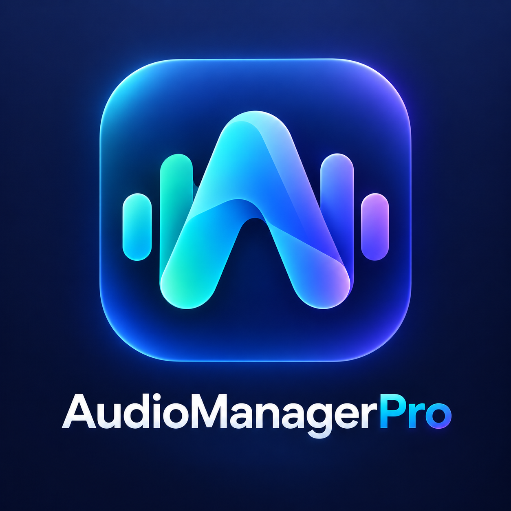
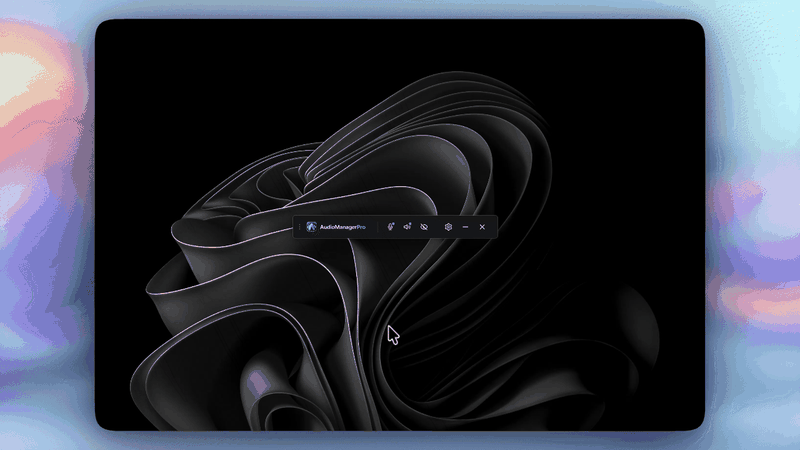

<p align="center">
  
</p>

<p align="center">
  <b>Звук в Windows работает так, как вы его настроили.</b><br>
  Нужный микрофон и наушники всегда по умолчанию, громкость на своём месте,<br>
  лишние аудиоустройства не мешают в играх и программах.
</p>

<p align="center">
  <a href="https://github.com/Gidroponik/AudioManagerPro/releases/latest"></a>
  <a href="https://github.com/Gidroponik/AudioManagerPro/releases"></a>
  
</p>

<p align="center">
  <a href="https://github.com/Gidroponik/AudioManagerPro/releases/latest/download/AudioManagerPro.exe"><b>⬇ Скачать AudioManagerPro.exe</b></a>
  &nbsp;·&nbsp;
  <a href="https://github.com/Gidroponik/AudioManagerPro/releases/latest">Все файлы релиза</a>
</p>

<p align="center">
  
</p>

## Зачем это нужно

Знакомая история: подключили гарнитуру по Bluetooth, запустили игру или обновился драйвер, и Windows сама переключила звук на монитор. Discord снова поднял чувствительность микрофона до 100%. В списке устройств в игре десяток виртуальных входов, и нужный приходится искать.

AudioManagerPro следит за этим за вас. Выбираете устройство и громкость один раз, дальше приложение тихо сидит в трее и возвращает всё обратно, если что-то поменялось.

## Возможности

**🎙 Микрофон по умолчанию**
Выберите устройство ввода, и оно станет основным в системе, в том числе для звонков. Включите «Удерживать», и если Windows или другая программа переключит микрофон, выбранный вернётся в течение секунды.

**🔊 Вывод звука по умолчанию**
То же самое для колонок и наушников. Подключили вторую гарнитуру, а Windows решила, что теперь звук идёт в неё? Приложение вернёт звук на выбранное устройство.

**🎚 Фиксированная громкость**
Задайте уровень ползунком и включите «Фиксировать громкость». Авто-усиление микрофона в мессенджерах и сброс громкости после обновлений перестанут быть проблемой.

**🧩 Для всех приложений**
В Windows можно назначить отдельной программе своё устройство, и тогда она игнорирует системный выбор. AudioManagerPro сбрасывает такие назначения, и все программы используют выбранное устройство. Отключается в настройках.

**👁 Скрытие устройств**
Виртуальные входы, HDMI-выходы мониторов, стерео-микшер — всё лишнее выключается одним переключателем и пропадает из списков во всех играх и программах. Кнопка «Скрыть все» оставит только системное и выбранное устройство. Ничего не удаляется: «Вернуть все скрытые» включает всё обратно.

**🪟 Аккуратная панель**
Компактная полоска, которую можно перетащить за три точки. По клику раскрывается в центр экрана, кнопкой «—» сворачивается в трей. При закрытии приложение спросит, точно ли его закрыть или просто свернуть.

**🚀 Автозапуск и обновления**
Приложение стартует вместе с Windows сразу в трей и без запроса UAC. Новые версии оно находит само и обновляется в один клик, с проверкой целостности файла.

## Установка

1. Скачайте [**AudioManagerPro.exe**](https://github.com/Gidroponik/AudioManagerPro/releases/latest/download/AudioManagerPro.exe) из последнего релиза.
2. Положите файл в постоянное место, например `C:\Program Files\AudioManagerPro\`, и запустите.
3. Подтвердите запрос прав администратора. Они нужны, чтобы менять системные настройки звука и работал автозапуск.
4. Откройте ⚙ и включите **Автозапуск с Windows**.

Установщика нет: это один exe-файл. Настройки хранятся в `%APPDATA%\AudioManagerPro\config.json`.

> **Windows SmartScreen** может предупредить о неизвестном издателе, потому что файл не подписан сертификатом. Нажмите «Подробнее» → «Выполнить в любом случае». Каждый релиз собирается GitHub Actions прямо из этого репозитория, рядом лежит `AudioManagerPro.exe.sha256` для сверки.

## Как пользоваться

| Кнопка | Что делает |
|:---:|---|
| ⋮ | Перетащить панель |
| 🎙 | Микрофон: выбор устройства, удержание, громкость |
| 🔊 | Вывод звука: колонки и наушники, удержание, громкость |
| 👁 | Скрыть или вернуть аудиоустройства в системе |
| ⚙ | Автозапуск, запуск в трей, поверх окон, обновления |
| — | Свернуть в трей (значок в трее возвращает панель) |
| ✕ | Закрыть приложение, с подтверждением |

Синяя точка на кнопке микрофона или динамика значит, что для этого устройства включено удержание или фиксированная громкость. `Esc` сворачивает открытую панель.

## Сборка из исходников

**Что нужно:**

| | Версия | Где взять |
|---|---|---|
| Windows | 10 или 11 | — |
| Go | 1.26+ | [go.dev/dl](https://go.dev/dl/) |
| Wails CLI | v2.11.0 | `go install github.com/wailsapp/wails/v2/cmd/wails@v2.11.0` |
| WebView2 Runtime | любая | уже есть в Windows 11; для Windows 10 — [developer.microsoft.com](https://developer.microsoft.com/microsoft-edge/webview2/) |

Node.js и C-компилятор не нужны: интерфейс написан на чистом HTML/CSS/JS и встраивается в exe как есть.

**Сборка:**

```powershell
git clone https://github.com/Gidroponik/AudioManagerPro.git
cd AudioManagerPro
wails build -clean -trimpath -ldflags "-s -w"
```

Готовый файл появится в `build\bin\AudioManagerPro.exe`. Локальная сборка показывает версию `dev` и не предлагает обновлений: они приходят только в релизные сборки.

**Тесты:**

```powershell
go test ./...
```

Тесты пакета `audio` работают с реальными устройствами компьютера. Они только читают состояние или записывают то же самое значение, поэтому ничего в системе не меняют.

## Под капотом

- **Go + [Wails v2](https://wails.io)**: нативное окно Windows с интерфейсом на WebView2. Весь exe около 11 МБ.
- **Windows Core Audio API** напрямую через COM: `IMMDeviceEnumerator`, `IAudioEndpointVolume`, `IPolicyConfig` для устройств по умолчанию и скрытия, `IAudioPolicyConfigFactory` для назначений отдельным приложениям.
- **Планировщик заданий** для автозапуска с правами администратора: Windows пропускает такие программы в разделе реестра `Run`.

```
audio/                 работа со звуковыми устройствами (COM)
app.go                 логика приложения и «сторож» устройств/громкости
updater_windows.go     проверка и установка обновлений
autorun_windows.go     автозапуск через Планировщик заданий
window_windows.go      анимация и позиционирование окна
tray.go                значок в трее
frontend/dist/         интерфейс
```

## Частые вопросы

**Удалил приложение, а скрытые устройства не вернулись.**
Скрытие — обычное системное отключение, поэтому вернуть устройства можно и без приложения. Нажмите `Win + R`, введите `mmsys.cpl`, щёлкните правой кнопкой по списку, включите «Показать отключённые устройства», затем по нужному устройству выберите «Включить».

**Как убрать из автозапуска?**
Выключите переключатель в настройках. Или удалите задачу `AudioManagerPro` в Планировщике заданий.

**Выбранное устройство отключено — что будет?**
Приложение подождёт. Как только устройство снова появится, оно станет устройством по умолчанию.
